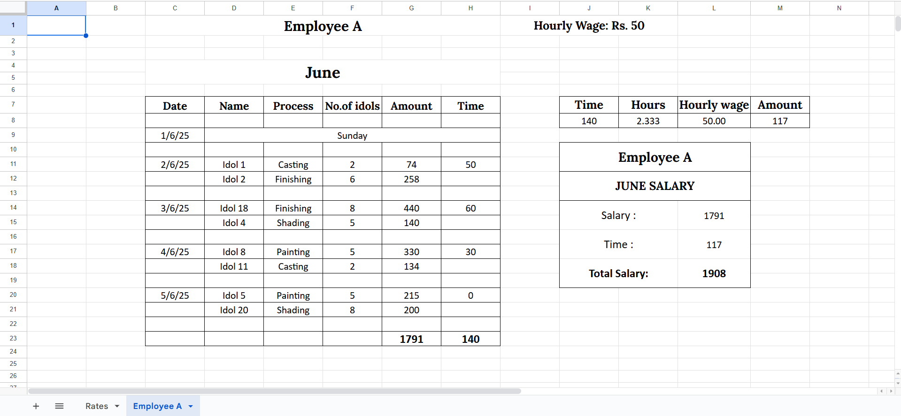
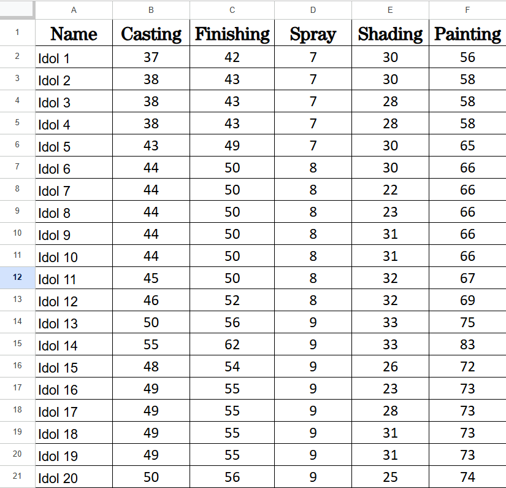
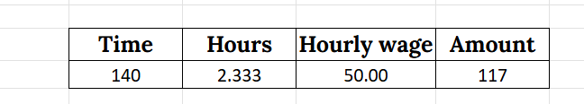

# 💼 Salary Calculator – Idol Manufacturing Payroll (Prototype)

🧪 This is a **functional prototype** of a custom-built salary automation system designed for an **idol manufacturing business**.  
The original live system is in **Marathi** and used internally. This version demonstrates the logic and automation in **English** using dummy data.

---

## 🛑 Problem Statement (Client Requirements)

In an idol manufacturing business:
- Employees are paid **based on their daily output**, not fixed salaries
- Each **idol type has different rates** for different processes (Casting, Finishing, Spray, Shading, Painting)
- Some employees also perform **non-production work** (e.g., support tasks) and need to be compensated by **hourly wage**
- Daily tracking was previously **manual, error-prone, and time-consuming**

### The client required a system that could:
- Automate idol-based pay based on process + quantity
- Track non-idol time-based work
- Provide clear daily/monthly salary totals per employee
- Be simple, formula-driven, and easy to use for non-technical users

---

## ✅ Solution (My Prototype)

I developed a **Google Sheets-based hybrid payroll system** that:

- Calculates idol-based pay by fetching process-specific rates via `VLOOKUP`
- Adds **hourly wage-based pay** for other work using time-to-amount conversion logic
- Tracks all work on a **daily basis**
- Sums everything into a final **monthly salary total**
- Allows scalable sheet duplication for new employees

📌 *The system is modular, cleanly structured, and ready for multi-employee scaling.*

---

## 🏗 Structure

| Sheet | Description |
|-------|-------------|
| `Rates` | Master sheet listing idol names with process-wise rates |
| `Employee_A` | Daily work log sheet showing idol-based and time-based pay |
| `formulas-used.md` | Technical breakdown of salary formulas used |

📎 *This prototype includes just one employee sheet for demonstration. The logic can be easily reused for additional workers.*

---

## ✨ Key Features

- 🔁 **Idol-based pay** via `VLOOKUP` for dynamic rate fetching
- ⏱ **Hourly wage logic** for non-idol work based on minutes worked
- 📊 Daily entry format with dropdowns for clean input
- 💰 Automated calculation of both daily and monthly salary
- 📁 Modular, clean sheet layout for easy replication per employee
- 🧠 All logic done using native Google Sheets formulas — no scripting required

---

## 🧪 How to Use This Sheet (Demo Instructions)

1. Open the [view-only demo sheet](https://docs.google.com/spreadsheets/d/1DgyJn4gT_QNLhCt_rulPE5VTjnSBHt4h/edit?usp=sharing)
2. Go to the `Employee_A` sheet
3. In the daily log:
   - Select an **idol name** (e.g., Idol 1)
   - Select the **process** (e.g., Casting, Finishing)
   - Enter the **quantity** completed
   - (Optional) Enter **minutes worked** for other non-idol tasks
4. Scroll to the bottom to view the **total monthly salary**

📌 All values are calculated automatically. No scripting or manual formulas needed.

---

## 💡 Tech Skills Practiced in This Project

- Spreadsheet logic design and salary structure mapping
- `VLOOKUP`, `IF`, `ROUND`, and `ISBLANK` chaining
- Data validation and dropdown creation
- Time-to-currency conversion using basic math
- Modular sheet design for scalable employee tracking
- Documentation using Markdown and GitHub best practices

---

## 🔣 Salary Calculation Logic (Summary)

- 💠 **Idol-based pay** is calculated using `VLOOKUP` based on idol type, process, and quantity
- ⏱ **Hourly wage** pay is calculated using time-in-mins × (daily wage ÷ 8)
- 📊 Monthly totals are summed automatically at the end of the sheet
  
---
📎 See full formula breakdown in [formulas-used.md](formulas-used.md)
---

## 📷 Screenshots

| Main Sheet | Rates Sheet | Formula Logic |
|------------|-------------|----------------|
|  |  |  |

---

## 🛠 Tools & Formulas

- **Google Sheets**
- Formulas: `VLOOKUP`, `IF`, `SUM`
- Data Validation (Dropdowns)
- Simple formatting + protection
- No macros or scripts — 100% formula logic

---

## 📁 Live Demo (View-only Sheet)

> [📎 Click here to view the prototype]([https://docs.google.com/spreadsheets/d/1DgyJn4gT_QNLhCt_rulPE5VTjnSBHt4h/edit?usp=sharing](https://docs.google.com/spreadsheets/d/1Y3kflrcyrC1fGHVqOmWEaucimqToZO18z6kgJfvTubc/edit?usp=sharing))

---

## 👩🏻‍💻 Author

**Sakshi Chandekar**  
📧 sakshichandekar24@gmail.com  
[GitHub](https://github.com/sakshichandekar) | [LinkedIn](https://linkedin.com/in/sakshi-chandekar-884262330)

---

> ⚠️ *This is a non-confidential prototype for demonstration only. The live business version is built in Marathi and used internally.*
